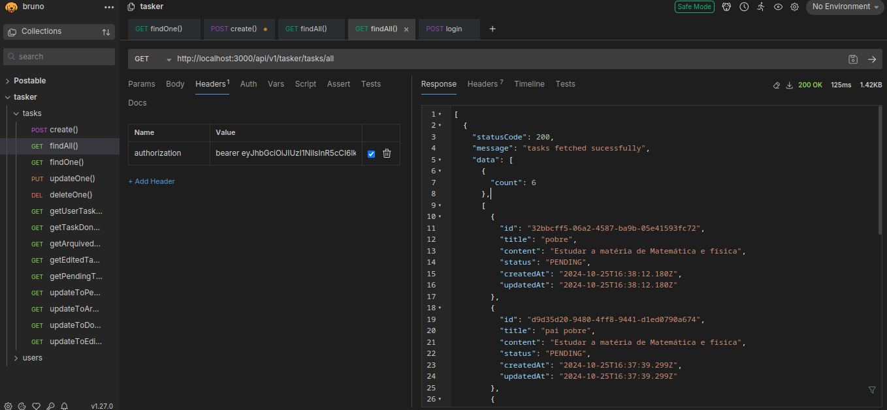

<div align="center">
  <h1>TASKER-API</h1>
</div>
<br />
<!-- TABLE OF CONTENTS -->
<details>
  <summary>Table of Contents</summary>
  <ol>
    <li>
      <a href="#about-the-project">About The Project</a>
      <ul>
        <li><a href="#built-with">Built With</a></li>
      </ul>
    </li>
    <li>
      <a href="#getting-started">Getting Started</a>
      <ul>
        <li><a href="#prerequisites">Prerequisites</a></li>
        <li><a href="#installation">Installation</a></li>
      </ul>
    </li>
    <li><a href="#usage">Usage</a></li>
    <li><a href="#contributing">Contributing</a></li>
    <li><a href="#license">License</a></li>
    <li><a href="#contact">Contact</a></li>
  </ol>
</details>

<!-- ABOUT THE PROJECT -->
## About The Project
Task is a API for tasks management build to be consumed for a simple todo APP.

## Features
* Complete Tasks CRUD(POST|GET|PUT|DELETE) Endpoints for  Tasks creations.
* JsonWebToken Authentication.
* Password Encryption.

### Built With
* TYPESCRIPT
* EXPRESS
* TYPEORM
* MYSQL
* JWT
<p align="right">(<a href="#readme-top">back to top</a>)</p>


<!-- GETTING STARTED -->
## Getting Started

### Prerequisites
Ensure your have installed on your machine: Vscode, node, npm(or preferencial), mysql.


### Installation
1. Clone the repo
   ```sh
   git clone https://github.com/marionorberto/tasker.git
   ```
2. Install NPM packages
   ```sh
   npm install
   ```
3. Create the Mysql Database: 'postable'.

4. Change your local .env variable(see exemple file: .env.example).

5. ensure that "sychronize: true" datasource object key is set.

6. run start script.
 ```sh
   npm run start:dev
   ```

<p align="right">(<a href="#readme-top">back to top</a>)</p>


<!-- USAGE EXAMPLES -->
## Usage
Use a HTTP Client to make your request: (postman/bruno/curl/insomnia or whatever)
* base endpoint -> http://localhost:3000/api/v1/tasker
* register -> http://localhost:3000/api/v1/tasker/create/user
* get acess_token -> http://localhost:3000/api/v1/tasker/signin

EX: (Get All particular user Posts): http://localhost:3000/api/v1/tasker/tasks/all



OBS: EXPLORE OTHER ENDPOINTS:

1.get     -> `/user/:userId`                           [token_required] <br>
2.post    -> `/create/user`                            ----------------  <br>
3.put     -> `/update/user/:userId`                    [token_required] <br>
4.delete  -> `/delete/user/:userId`                    [token_required] <br>
5.get     -> `/tasks/all`                              [token_required] <br>
6.get     -> `/task/:taskId`                           [token_required] <br>
7.post    -> `create/task`                             [token_required] <br>
8.put     -> `update/task/:taskId`                     [token_required] <br>
9.delete  -> `/delete/task/:taskId`                    [token_required] <br>
10.get    -> `/tasks/user/:userId`                     [token_required]  <br>
11.get    -> `/tasks/task/done/:userId`                [token_required]   <br>
12.get    -> `/tasks/task/edited/:userId`              [token_required] <br>
13.get    -> `/tasks/task/arquived/:userId`            [token_required] <br>
14.get    -> `/tasks/task/:taskId/update-to-pending`   [token_required] <br>
15.get    -> `/tasks/task/:taskId/update-to-done`      [token_required] <br>
16.get    -> `/tasks/task/:taskId/update-to-edited`    [token_required] <br>
17.get    -> `/tasks/task/:taskId/update-to-arquived`  [token_required] <br>


<p align="right">(<a href="#readme-top">back to top</a>)</p>


<!-- CONTRIBUTING -->
## Contributing
If you have a suggestion that would make this better, please fork the repo and create a pull request. You can also simply open an issue with the tag "enhancement".
Don't forget to give the project a star! Thanks again!

1. Fork the Project
2. Create your Feature Branch (`git checkout -b feature/AmazingFeature`)
3. Commit your Changes (`git commit -m 'Add some AmazingFeature'`)
4. Push to the Branch (`git push origin feature/AmazingFeature`)
5. Open a Pull Request

<p align="right">(<a href="#readme-top">back to top</a>)</p>

<!-- LICENSE -->
## License
Distributed under the MIT License.


## Contact
Mário Norberto - [@linkedin.com/in/marionorberto](https://linkedin.com/in/marionorberto) - marionorberto2018@gmail.com

Project Link: [https://github.com/marionorberto/postable](https://github.com/marionorberto/tasker)

<p align="right">(<a href="#readme-top">back to top</a>)</p>